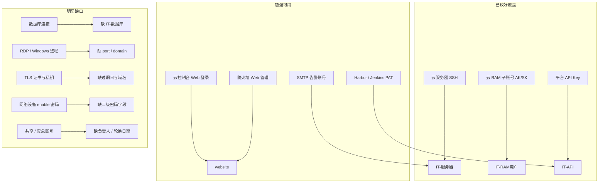
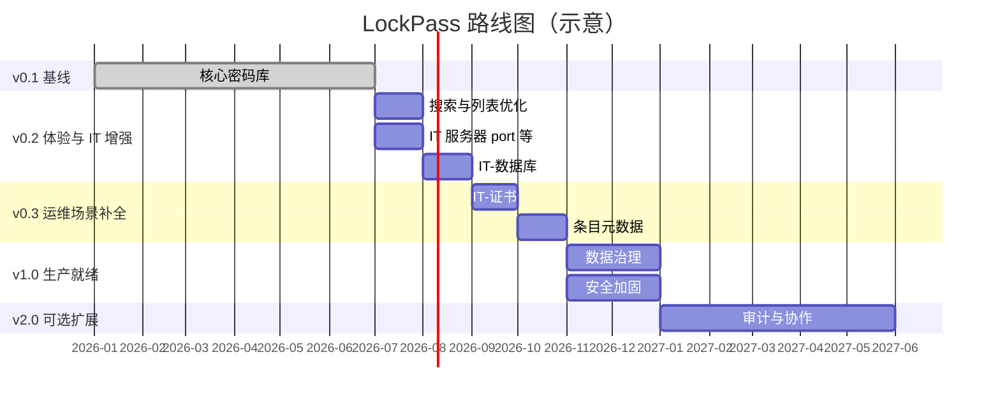

# LockPass 产品路线图

> 本文档描述 LockPass 的当前能力、已知边界与后续演进规划。  
> 实现细节见 [WIKI.md](WIKI.md)，快速上手见 [README.md](README.md)。

**最后更新**：2026-07-11

---

## 1. 产品定位

LockPass 是面向**团队内网**的自托管密码管理应用，核心目标是：

- 安全保存网站账号、个人卡券、IT 运维凭证
- 部署简单、依赖少、可插拔存储
- 不做 Vault / 1Password 级别的企业全功能替代

**设计原则**

| 原则 | 说明 |
|------|------|
| 轻量优先 | 功能以「能存、能找、能备份」为主，避免过度工程 |
| 类型驱动 | 条目按场景分类型，字段随类型变化，减少万能表单 |
| 服务端加密 | 敏感 payload 统一 AES-256-GCM，管理员持密钥可解密 |
| 内网可信 | 不强制 HTTPS，适合可信网络；公网需反向代理 |
| 可迁移 | JSON 导入导出作为跨后端、跨版本的数据通道 |

---

## 2. 当前状态（v0.1 — 已完成）

### 2.1 核心能力

| 模块 | 状态 | 说明 |
|------|------|------|
| 用户认证 | ✅ | `config/users.json` 预置用户，iron-session 会话 |
| 单层分组 | ✅ | 创建/重命名/删除分组，条目归属单一分组 |
| 条目 CRUD | ✅ | 创建、查看、编辑；**不可物理删除**，仅可废弃 |
| 多类型条目 | ✅ | 网站、个人卡券、IT-服务器 / IT-RAM用户 / IT-API |
| 密码生成器 | ✅ | 独立页面 + 表单内嵌；服务端 API 统一生成逻辑 |
| 导入导出 | ✅ | JSON 全库 merge / replace 两种模式 |
| 存储后端 | ✅ | SQLite（默认）、文本 JSON、PostgreSQL |
| 敏感字段加密 | ✅ | payload 整体加密存储 |
| 旧数据迁移 | ✅ | 旧版 IT 类型与字段读取/导入时自动迁移 |

### 2.2 页面与路由

| 路由 | 功能 |
|------|------|
| `/login` | 登录 |
| `/` | 密码库首页（分组侧栏 + 条目列表） |
| `/items/new` | 新建条目 |
| `/items/[id]` | 条目详情 / 编辑 |
| `/generator` | 密码生成器 |
| `/import-export` | 导入导出 |

### 2.3 条目类型与字段（现状）

| 类型 | 显示名 | Payload 字段 | 敏感字段 |
|------|--------|--------------|----------|
| `website` | 网站 | url, username, password, notes | password |
| `card` | 个人卡券 | cardName, cardNumber, expiry, cvv, pin, holderName, notes | cardNumber, cvv, pin |
| `it_server` | IT-服务器 | instanceId, instanceName, privateIp, publicIp, username, password, notes | password |
| `it_ram` | IT-RAM用户 | platform, accountName, username, password, accessKeyId, accessKeySecret, notes | password, accessKeyId, accessKeySecret |
| `it_api` | IT-API | platform, username, password, apiKey, notes | password, apiKey |

> IT-服务器根据内外网 IP 与用户名**动态生成** SSH 登录指令（只读 + 复制），不写入 payload。三种 IT 类型各有专属表单与详情字段。

### 2.4 已知限制

- 条目废弃后**不可恢复**
- 废弃条目**不可物理删除**（需导出编辑 JSON 后全量替换）
- **不支持**加密密钥在线轮换
- **无**搜索、筛选、排序（除默认按更新时间倒序）
- **无**审计日志、访问记录
- IT 类型**无** `port`、`database` 等连接字段（数据库场景仍缺专属类型）
- 证书过期日、网络设备二级密码等**无专门字段**
- 多用户数据按 `userId` 隔离，但**无**组级/条目级权限

---

## 3. IT 运维场景覆盖分析

结合运维实际保存凭证的场景，对照当前能力：



### 3.1 场景优先级矩阵

| 运维域 | 典型场景 | 当前覆盖 | 优先级 | 建议方向 |
|--------|----------|----------|--------|----------|
| 主机访问 | Linux SSH / 云服务器 | ✅ IT-服务器 | — | 已支持内外网 IP + SSH 指令生成 |
| 主机访问 | Windows RDP | ⚠️ IT-服务器 | **P1** | port + domain 或 IT-RDP |
| 主机访问 | iLO/iDRAC/BMC | ⚠️ IT-服务器 | P2 | 可用实例字段 + 公网 IP |
| 数据库 | MySQL/PG/Redis 等 | ❌ | **P0** | 新增 IT-数据库 |
| 云与 API | RAM 子账号 AK/SK | ✅ IT-RAM用户 | — | 已覆盖 |
| 云与 API | 平台 API Key | ✅ IT-API | — | 已覆盖 |
| 云与 API | 云控制台登录 | ⚠️ website | P2 | 保持 website 或 IT-供应商 |
| 中间件 | Jenkins/Harbor Token | ✅ IT-Token | — | 够用 |
| 监控告警 | Grafana/Zabbix 账号 | ⚠️ website/IT | P2 | 现有类型 + 分组规范 |
| 监控告警 | SMTP Relay | ❌ | P2 | IT-SMTP 或扩展现有字段 |
| 证书 | TLS 私钥 + 过期日 | ❌ | **P1** | IT-证书 |
| 网络设备 | 交换机 enable 密码 | ❌ | P2 | enablePassword 或 IT-网络设备 |
| 应急 | Break-glass 共享账号 | ⚠️ notes | P2 | 元数据：负责人、轮换日 |
| K8s | kubeconfig 大文本 | ⚠️ privateKey | P3 | 保持 privateKey，notes 说明 |

---

## 4. 路线图总览



> 时间为示意排期，按实际投入调整。每个版本发布前须同步更新 README / WIKI。

---

## 5. 分阶段详细规划

### Phase 0 — v0.1 基线 ✅（当前）

**目标**：可用的团队内网密码库 MVP。

**已交付**

- [x] 认证、分组、条目 CRUD、废弃机制
- [x] 网站 / 个人卡券 / IT-服务器 / IT-RAM用户 / IT-API 三类专属字段
- [x] IT-服务器 SSH 登录指令自动生成（只读 + 复制）
- [x] 密码生成器、导入导出
- [x] 三种存储后端、AES 加密
- [x] `it_key` → IT-* 类型迁移

---

### Phase 1 — v0.2：体验优化 + IT 基础增强

**目标**：提升日常使用效率；补齐 IT 运维最高频的字段缺口。

**预计周期**：4–6 周

#### 1.1 列表与检索（P0）

| 任务 | 说明 | 验收标准 |
|------|------|----------|
| 条目搜索 | 按名称、备注模糊搜索 | 首页可即时过滤当前分组或全库 |
| 类型筛选 | 按条目类型过滤 | 支持多选或下拉 |
| 状态筛选 | 隐藏/仅显示废弃条目 | 默认隐藏废弃，可切换 |
| 空状态优化 | 无分组、无条目时的引导 | 明确 CTA（创建分组 / 新建条目） |

**涉及文件**：`(protected)/page.tsx`、`group-sidebar.tsx`、可选新 API 查询参数

#### 1.2 IT 字段补全（P1）

| 任务 | 说明 | 验收标准 |
|------|------|----------|
| 增加 `port` | IT-服务器可选 SSH 端口 | 表单/详情展示；SSH 指令可拼接 `-p` |
| RAM `region` | IT-RAM用户 可选默认区域 | 表单/详情展示 |
| 导入导出兼容 | 新字段不影响 v1 导出格式 | 旧 JSON 导入正常 |

> IT 三类专属字段与 SSH 指令生成已于 v0.1 完成；本节为后续横切增强。

**涉及文件**：`src/lib/types/index.ts`、`item-form`、`item-detail`、`src/lib/it-commands.ts`

#### 1.3 新增 IT-数据库（P0）

**场景**：MySQL、PostgreSQL、Redis、MongoDB 等——运维最高频且字段模式与服务器登录不同。

**建议字段**

| 字段 | 类型 | 敏感 | 说明 |
|------|------|------|------|
| host | string | 否 | 主机地址 |
| port | string | 否 | 端口，如 3306 |
| database | string | 否 | 库名 / instance |
| username | string | 否 | 账号 |
| password | string | 是 | 密码 |
| role | string | 否 | 只读 / 读写 / 管理员（可选枚举） |
| notes | string | 否 | 备注 |

**类型 ID**：`it_database`，显示名 **IT-数据库**

**任务清单**

- [ ] `ItemType` + `DatabasePayload` + `ITEM_TYPE_LABELS`
- [ ] `ItemForm` / `ItemDetail` 专用表单
- [ ] API Zod schema 更新
- [ ] WIKI §5 数据模型、README §功能
- [ ] 无自动迁移（新类型，非旧数据变更）

---

### Phase 2 — v0.3：运维场景补全

**目标**：覆盖证书、云密钥、运维元数据等 P1/P2 场景。

**预计周期**：6–8 周

#### 2.1 新增 IT-证书（P1）

**场景**：TLS 证书私钥、代码签名证书，需关注过期日。

| 字段 | 敏感 | 说明 |
|------|------|------|
| domain | 否 | 主域名 / CN |
| issuer | 否 | 颁发者 |
| expiresAt | 否 | 过期日（ISO 日期） |
| privateKey | 是 | PEM 私钥 |
| passphrase | 是 | 私钥口令 |
| notes | 否 | 备注 |

**类型 ID**：`it_cert`，显示名 **IT-证书**

**扩展（可选）**

- 首页 / 详情过期预警（30 天内高亮）
- 列表按过期日排序

#### 2.2 ~~新增 IT-云密钥~~ → 已由 IT-RAM用户 覆盖 ✅

云 RAM 子账号 AK/SK 已由 **IT-RAM用户**（`it_ram`）类型承载：`platform`、`accountName`、`accessKeyId`、`accessKeySecret` 等字段。后续可按需增加 `region` 等扩展字段，不再单独新增 `it_cloud_key` 类型。

#### 2.3 新增 IT-RDP（P1，可选方案）

**方案 A**：新增独立类型 `it_rdp`（**IT-RDP**）  
**方案 B**：不新增类型，仅在 IT-服务器上增加 `domain` 字段 + `port` 默认 3389

| 方案 | 优点 | 缺点 |
|------|------|------|
| A 独立类型 | 语义清晰，表单可定制 | 类型数 +1 |
| B 扩展现有 | 改动小 | IT-服务器 语义变宽 |

**建议**：若 Phase 1 已为 IT 类型增加 `port`，优先 **方案 B**；若运维团队 RDP 条目多，再拆 **方案 A**。

#### 2.4 条目元数据（P2）

非敏感、面向运维管理的公共字段，可挂在所有类型或仅 IT 类型：

| 字段 | 说明 |
|------|------|
| owner | 负责人 |
| expiresAt | 凭证过期日（通用，不仅证书） |
| lastRotatedAt | 上次轮换日期 |
| environment | 环境标签：prod / staging / dev |

**实现注意**

- 元数据存 payload 内（加密边界不变）或条目表新增列——优先 payload 内嵌，避免 schema 迁移
- 列表支持按 `environment` 筛选

#### 2.5 新增 IT-SMTP（P2，按需）

| 字段 | 敏感 | 说明 |
|------|------|------|
| host | 否 | SMTP 服务器 |
| port | 否 | 通常 25/465/587 |
| username | 否 | 账号 |
| password | 是 | 密码 |
| from | 否 | 发件人地址 |
| notes | 否 | 备注 |

**类型 ID**：`it_smtp`，显示名 **IT-SMTP**

---

### Phase 3 — v1.0：生产就绪

**目标**：数据治理与安全加固，适合长期在内网生产使用。

**预计周期**：6–8 周

#### 3.1 数据治理

| 任务 | 优先级 | 说明 |
|------|--------|------|
| 废弃条目恢复 | P1 | `discarded` → `active`，需二次确认 |
| 废弃条目物理删除 | P2 | 仅允许删除已废弃条目，或管理员导出后清理 |
| 条目硬删除 API | P2 | 与审计日志配套时再开放 |
| 导出格式版本化 | P1 | `ExportData.version: 2`，记录类型变更历史 |
| 存储层迁移脚本 | P2 | 可选 drizzle migrations，替代内联 DDL |
| 启动时遗留数据迁移 | P1 | 将仍存为 `it_key` 的 DB 记录批量改写为新类型 |

#### 3.2 安全加固

| 任务 | 优先级 | 说明 |
|------|--------|------|
| 会话超时配置 | P1 | `SESSION_MAX_AGE` 环境变量 |
| 登录失败限制 | P1 | 防暴力破解（内存计数或持久化） |
| 导出二次确认 | P1 | 导出前明确提示含明文敏感数据 |
| 加密密钥轮换指南 | P2 | 文档 + 脚本：导出 → 换 key → 重新加密导入 |
| `SECURE_COOKIES` 生产检查 | P1 | 启动时 warn 若生产环境未启用 HTTPS |

#### 3.3 质量与可观测

| 任务 | 说明 |
|------|------|
| API 集成测试 | 覆盖 auth、items CRUD、vault 导入导出 |
| E2E 冒烟测试 | 登录 → 建条目 → 导出 |
| 健康检查端点 | `GET /api/health` 供反向代理探测 |
| 结构化日志 | 请求 ID、错误分类（不含敏感信息） |

---

### Phase 4 — v2.0：协作与审计（可选）

**目标**：多成员协作与合规需求。**仅在团队规模扩大后考虑**，避免过早复杂化。

| 能力 | 说明 | 复杂度 |
|------|------|--------|
| 审计日志 | 谁何时查看/编辑/导出哪类条目（不记录明文） | 高 |
| 条目级权限 | 分组或条目 ACL | 高 |
| 共享链接 | 限时查看单条凭证 | 高 |
| TOTP 二步验证 | 用户登录 MFA | 中 |
| 变更通知 | 条目更新 webhook / 邮件 | 中 |
| 批量导入 CSV | 从 Excel/运维台账迁移 | 中 |
| 移动端适配 | 响应式优化或 PWA | 中 |

---

## 6. 明确不做（Out of Scope）

以下能力**不在** LockPass 路线内，避免与专业产品竞争：

| 能力 | 原因 |
|------|------|
| 浏览器扩展自动填表 | 需客户端生态，偏离内网自托管定位 |
| 零知识架构（用户主密码） | 当前为服务端加密模型，架构级变更 |
| 实时密钥轮换（Vault 动态密钥） | 复杂度过高 |
| HSM / KMS 集成 | 内网轻量场景不优先 |
| 完整证书生命周期管理（ACME 续期） | 非密码库核心 |
| 多租户 SaaS 化 | 保持自托管单团队部署 |
| 公开用户注册 | 维持预置用户 + 配置文件模式 |

---

## 7. 类型扩展标准流程

每新增一种条目类型，统一按以下清单实施（与 WIKI §14.2 一致）：

```
1. src/lib/types/index.ts
   - ItemType 联合类型
   - Payload 接口
   - ITEM_TYPE_LABELS
2. src/components/item-form/index.tsx   — 表单字段
3. src/components/item-detail/index.tsx — 详情展示
4. src/app/api/items/route.ts           — 创建 schema
5. src/app/api/items/[id]/route.ts      — 更新 schema
6. 导入导出兼容（migrateLegacy* 如有需要）
7. README §功能 + WIKI §5 / §17
```

**命名约定**

- 类型 ID：`snake_case`，IT 类以 `it_` 前缀
- 显示名：IT 类用 **IT-\*** 格式（如 IT-数据库、IT-证书）
- 敏感字段：编辑用 `PasswordInput`，只读用 `SensitiveValue` + `copyable`

---

## 8. 推荐实施顺序（Next Steps）

结合投入产出，建议接下来 **3 个月内** 按此顺序推进：

| 顺序 | 里程碑 | 核心理由 |
|------|--------|----------|
| 1 | v0.2 — 搜索 + 列表筛选 | 条目增多后的刚需，改动集中在前端 |
| 2 | v0.2 — IT-数据库 | 运维最高频缺口，字段差异大、值得单独建模 |
| 3 | v0.2 — IT-服务器 port 等横切字段 | 完善 SSH / 区域等连接信息 |
| 4 | v0.3 — IT-证书 + 过期提醒 | 证书轮换是运维痛点 |
| 5 | v1.0 — 废弃恢复 + 遗留数据批量迁移 | 生产长期使用的基础治理 |

---

## 9. 成功指标

| 阶段 | 指标 |
|------|------|
| v0.2 | 运维常用场景（SSH/DB/API）无需写进 notes；首页 3 秒内可定位条目 |
| v0.3 | 证书有专属类型；80% 运维台账可从 Excel 迁入 |
| v1.0 | 核心 API 有自动化测试；导出/废弃/迁移有 documented 流程 |
| v2.0 | 审计满足内部合规检查（若启用） |

---

## 10. 文档与变更同步

- 每个 Phase 交付时更新 [README.md](README.md) §功能 与 [WIKI.md](WIKI.md) 相关章节
- 显著变更追加 WIKI §17 变更记录
- 本 RoadMap 在阶段完成后勾选对应 checkbox，并更新 §2 当前状态

---

## 附录 A：条目类型演进全景

| 阶段 | 类型 | 显示名 |
|------|------|--------|
| v0.1 ✅ | website | 网站 |
| v0.1 ✅ | card | 个人卡券 |
| v0.1 ✅（已废弃） | it_ssh / it_token | IT-SSH / IT-Token |
| v0.1 ✅ | it_server | IT-服务器 |
| v0.1 ✅ | it_ram | IT-RAM用户 |
| v0.1 ✅ | it_api | IT-API |
| v0.2 | it_database | IT-数据库 |
| v0.3 | it_cert | IT-证书 |
| v0.3（可选） | it_rdp | IT-RDP |
| v0.3（按需） | it_smtp | IT-SMTP |
| v0.3（按需） | it_network | IT-网络设备 |

## 附录 B：相关文档

- [README.md](README.md) — 功能概览与快速开始
- [WIKI.md](WIKI.md) — 架构、API、数据模型、开发约定
- [AGENTS.md](AGENTS.md) — AI / 开发协作约定
