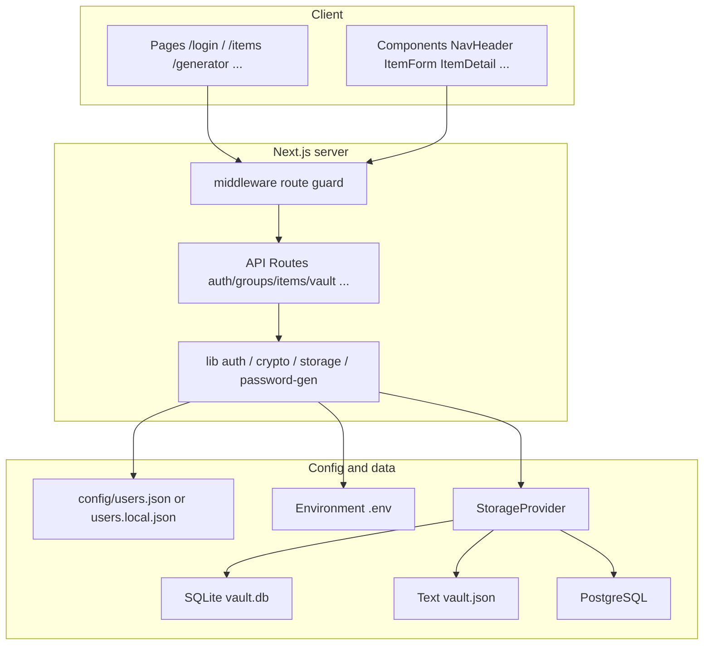
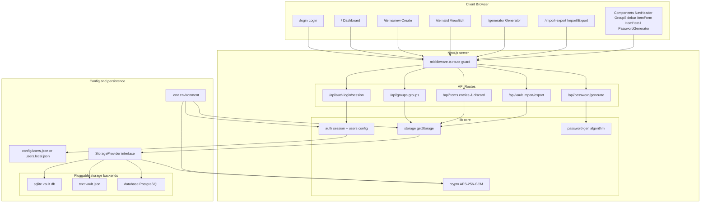
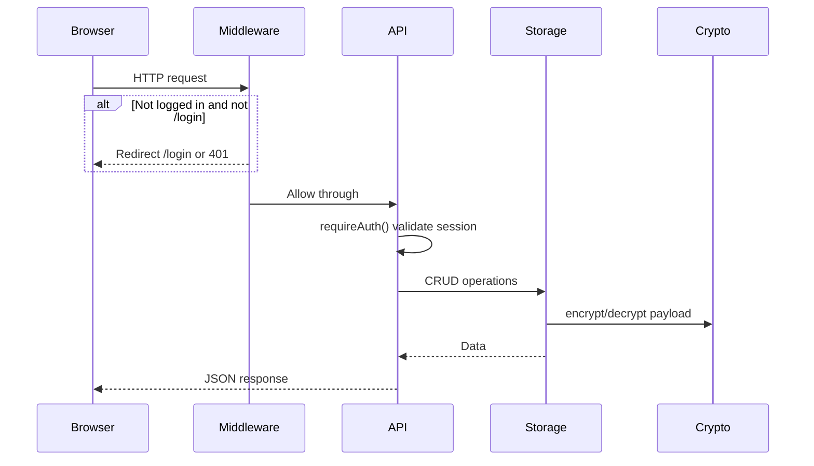
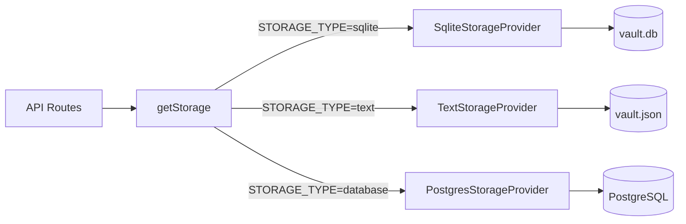
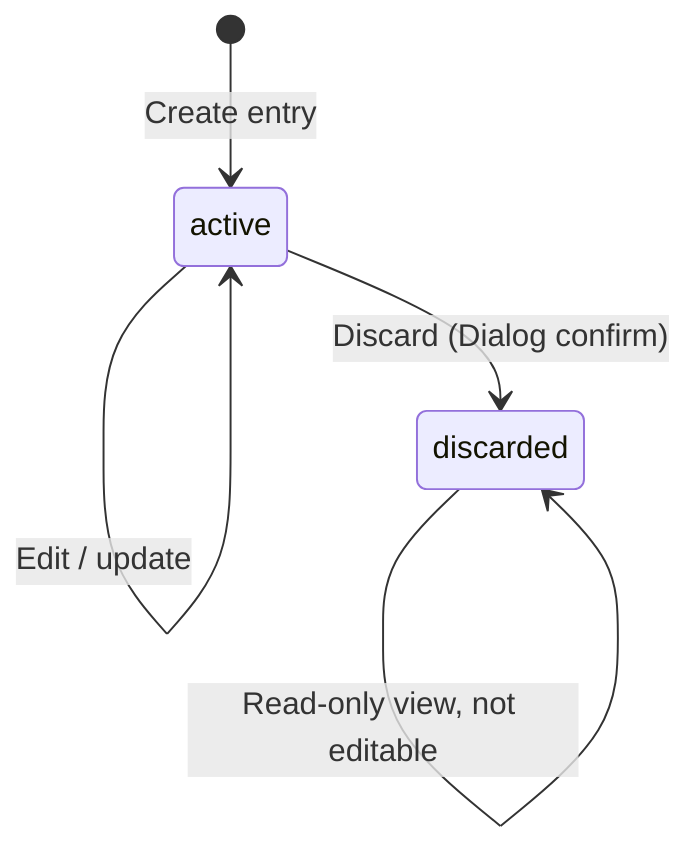

# LockPass Project Wiki

**Language:** [English](WIKI.md) | [中文](WIKI.zh-CN.md)

> Knowledge base for new teammates and AI tools: architecture, code layout, data flow, APIs, components, ops, and conventions.
>
> Quick start: [README.md](README.md) ([中文](README.zh-CN.md)).

---

## 1. Project overview

**LockPass** is a self-hosted password manager for securely storing website accounts, personal cards/vouchers, and IT credentials (SSH/API/tokens/servers) on an internal team network.

### Core features

| Feature | Description |
|------|------|
| Single-level groups | Each vault entry belongs to one group; groups are flat (no nesting) |
| Multiple entry types | Website / Personal card / IT-Server / IT-RAM user / IT-API — fields vary by type |
| Password generator | Configurable length, character sets, minimum counts, exclude ambiguous characters |
| Import / export | Full-vault JSON backup and restore |
| Pluggable storage | Text file / SQLite (default) / PostgreSQL |
| Preconfigured users | Loaded from user config files; no self-registration |
| Discard instead of delete | Entries cannot be deleted after creation — only marked **discarded**; can be moved to the system **Discarded** group |
| Change history | Each save records changed fields; shown newest-first below the detail view; sensitive fields masked + copy/reveal |
| Server-side encryption | AES-256-GCM for sensitive payload |

### Tech stack

- **Framework**: Next.js 16 (App Router) + React 19 + TypeScript
- **Styling**: Tailwind CSS 4
- **Sessions**: iron-session
- **Validation**: Zod 4
- **ORM**: Drizzle ORM
- **Database**: better-sqlite3 / postgres.js
- **Encryption**: Node.js `crypto` (AES-256-GCM)
- **Password hashing**: bcryptjs

### High-level architecture

LockPass follows a classic B/S stack: browser pages → Next.js middleware & API → core libraries → pluggable storage backend. Sensitive payload is encrypted with AES-256-GCM before persistence.



For layered design, request flow, and storage choices, see [§4 Architecture and data flow](#4-architecture-and-data-flow).

---

## 2. Quick start

```bash
# 1. Install dependencies
npm install

# 2. Configure environment variables
cp .env.example .env.local
# Edit ENCRYPTION_KEY (64-char hex) and SESSION_SECRET

# 3. Generate encryption key
node -e "console.log(require('crypto').randomBytes(32).toString('hex'))"

# 4. Configure users (optional; default admin/admin123)
npm run hash-password -- your-password
# Write the output hash into your active users file (see §10)

# 5. Start (SQLite by default)
npm run dev
# Open http://localhost:3000
```

### Default account

- Username: `admin`
- Password: `admin123`

---

## 3. Directory structure

```
lock-pass/
├── config/
│   ├── users.json                 # Default user list (admin/admin123)
│   └── users.local.json           # Production override (gitignored; preferred on servers)
├── data/                          # Runtime data (gitignored; do not commit)
│   ├── vault.db                   # SQLite mode
│   └── vault.json                 # Text mode
├── scripts/
│   ├── hash-password.ts           # bcrypt password hash generator
│   └── service.sh                 # Production service start/stop/restart/status
├── src/
│   ├── app/                       # Next.js App Router
│   │   ├── layout.tsx             # Root layout (fonts, global styles)
│   │   ├── globals.css
│   │   ├── login/page.tsx         # Public: login page
│   │   ├── (protected)/           # Authenticated route group
│   │   │   ├── layout.tsx         # NavHeader navigation bar
│   │   │   ├── page.tsx           # Dashboard (groups + item list)
│   │   │   ├── generator/         # Standalone password generator
│   │   │   ├── import-export/     # Import / export
│   │   │   └── items/
│   │   │       ├── new/           # Create entry
│   │   │       └── [id]/          # Entry detail (view / edit)
│   │   └── api/                   # REST API
│   ├── components/                # React components
│   ├── lib/                       # Core business logic
│   └── middleware.ts              # Route guard
├── .env.example
├── README.md
├── README.zh-CN.md
├── WIKI.md                        # This file (English)
└── WIKI.zh-CN.md                  # Chinese wiki
```

### Key file index

| Concern | Path |
|--------|----------|
| Type definitions | `src/lib/types/index.ts` |
| Storage abstraction | `src/lib/storage/provider.ts` |
| Storage factory | `src/lib/storage/index.ts` |
| SQLite implementation | `src/lib/storage/sqlite.ts` |
| Text file implementation | `src/lib/storage/text.ts` |
| PostgreSQL implementation | `src/lib/storage/postgres.ts` |
| Encryption / decryption | `src/lib/crypto/encryption.ts` |
| Session config | `src/lib/auth/session.ts` |
| User loading | `src/lib/auth/users.ts` |
| Password generator algorithm | `src/lib/password-gen/generator.ts` |
| Route guard | `src/middleware.ts` |
| Next.js config | `next.config.ts` |

---

## 4. Architecture and data flow

### 4.1 Overall architecture

The diagram below shows LockPass from browser to persistent storage for a quick mental model.



**Layer summary:**

| Layer | Responsibility | Key paths |
|------|------|----------|
| Client | Page rendering and user interaction | `src/app/`, `src/components/` |
| Route guard | Block unauthenticated access; whitelist `/login` | `src/middleware.ts` |
| API | REST endpoints, Zod validation, session auth | `src/app/api/` |
| Core library | Auth, encryption, storage abstraction, password algorithm | `src/lib/` |
| Persistence | User config, environment, three storage backends | `config/`, `data/`, PostgreSQL |

At startup, `STORAGE_TYPE` selects the storage backend (default `sqlite`). Business code uses `getStorage()` uniformly without knowing the concrete implementation.

### 4.2 Request flow



### 4.3 Storage layer architecture



All backends implement the same `StorageProvider` interface. Business code obtains a singleton via `getStorage()` and does not depend on a specific backend.

### 4.4 Encryption strategy

- **Encrypted object**: The entire `payload` (JSON object) is serialized and encrypted as a whole
- **Algorithm**: AES-256-GCM
- **Key**: Environment variable `ENCRYPTION_KEY` (64 hex chars = 32 bytes)
- **Storage format**: `base64(IV[12 bytes] + authTag[16 bytes] + ciphertext)`
- **Stored in plaintext**: `name`, `type`, `groupId`, `status` (for list display and filtering)

```typescript
// On write
encryptedPayload = encrypt(JSON.stringify(payload))

// On read
payload = JSON.parse(decrypt(encryptedPayload))
```

---

## 5. Data model

### 5.1 Type definitions

Source: `src/lib/types/index.ts`

```typescript
type ItemType =
  | "website"
  | "card"
  | "it_server"
  | "it_ram"
  | "it_api"
type ItemStatus = "active" | "discarded"

interface Group {
  id: string
  userId: string
  name: string
  createdAt: Date
}

interface VaultItem {
  id: string
  userId: string
  groupId: string
  type: ItemType
  name: string
  status: ItemStatus
  payload: WebsitePayload | CardPayload | ItServerPayload | ItRamPayload | ItApiPayload
  createdAt: Date
  updatedAt: Date
}

interface ItemChangeEntry {
  field: string
  oldValue?: string
  newValue?: string
}

interface ItemChangeRecord {
  id: string
  itemId: string
  userId: string
  changes: ItemChangeEntry[]
  createdAt: Date
}
```

### 5.2 Payload fields by type

| Type | Display name | Fields | Sensitive |
|------|--------|------|------|
| **website** | Website | url, username, password, notes | password |
| **card** | Personal card | cardName, cardNumber, expiry, cvv, pin, holderName, notes | cardNumber, cvv, pin |
| **it_server** | IT-Server | instanceId, instanceName, privateIp, publicIp, username, password, notes | password |
| **it_ram** | IT-RAM user | platform, accountName, username, password, accessKeyId, accessKeySecret, notes | password, accessKeyId, accessKeySecret |
| **it_api** | IT-API | platform, username, password, apiKey, notes | password, apiKey |

**IT-Server SSH commands**: The detail page and edit form dynamically generate read-only commands from `username` + `privateIp` / `publicIp` (`ssh username@IP`). Shown only when values exist; each line has a copy button. Commands are not stored in the payload.

Legacy types `it_key`, `it_ssh`, `it_token` and old fields (`host` / `secret`, etc.) are migrated automatically on read and import to the types and fields above.

### 5.3 Entry state machine



- **active**: Normal state — view, edit, discard
- **discarded**: Discarded — view only; still listed (semi-transparent + label)

### 5.4 Export format

```typescript
interface ExportData {
  version: 1
  exportedAt: string       // ISO timestamp
  groups: Group[]
  items: VaultItem[]       // payload in plaintext (decrypted)
}
```

### 5.5 Entry change history

- On each `PUT /api/items/[id]` save, diff against current data and record **only changed fields** in one `ItemChangeRecord`
- Change content (including new values of sensitive fields) is encrypted with AES-256-GCM and stored in the `item_changes` table (SQLite/PostgreSQL) or the `itemChanges` array in `vault.json` (Text)
- Creating an entry does not write a change record; saves with no actual changes are not recorded
- Deleting a group or full replace import cascades removal of related change records

---

## 6. API reference

All APIs except `/api/auth/login` require authentication (middleware).

### 6.1 Authentication

#### `POST /api/auth/login`

```json
// Request
{ "username": "admin", "password": "admin123" }

// Response 200
{ "username": "admin" }

// Response 400
{ "error": "Invalid username or password" }
```

- Rate limit: max 5 attempts per IP per minute (`src/lib/api-utils.ts`)
- On success, sets `lockpass_session` cookie

#### `POST /api/auth/logout`

Destroys the session; returns `{ "ok": true }`.

#### `GET /api/auth/me`

```json
{ "isLoggedIn": true, "username": "admin", "userId": "u1" }
```

### 6.2 Groups

| Method | Path | Description |
|------|------|------|
| GET | `/api/groups` | List all groups for the current user |
| POST | `/api/groups` | Create group `{ "name": "Work" }` |
| PUT | `/api/groups/[id]` | Rename `{ "name": "New name" }` |
| DELETE | `/api/groups/[id]` | Delete group; returns 400 if **active entries** exist; allowed when only discarded entries remain (moved to **Discarded** group) |

### 6.3 Items

| Method | Path | Description |
|------|------|------|
| GET | `/api/items` | List; optional `?groupId=xxx` |
| GET | `/api/items/[id]` | Single entry (decrypted payload) |
| POST | `/api/items` | Create; `status` forced to `active` |
| PUT | `/api/items/[id]` | Update; **discarded entries cannot be updated**; writes change record when fields change |
| POST | `/api/items/[id]/discard` | Discard entry; optional `{ "moveToDiscardedGroup": true }` to move to **Discarded** group |
| GET | `/api/items/[id]/changes` | Entry change history (newest first) |

#### Create entry example

```json
{
  "groupId": "uuid",
  "type": "website",
  "name": "GitHub",
  "payload": {
    "url": "https://github.com",
    "username": "admin",
    "password": "secret123",
    "notes": ""
  }
}
```

### 6.4 Password generation

#### `POST /api/password/generate`

```json
// Request
{
  "length": 16,
  "includeUppercase": true,
  "includeLowercase": true,
  "includeNumbers": true,
  "includeSpecial": true,
  "minNumbers": 1,
  "minSpecialChars": 1,
  "excludeAmbiguous": true
}

// Response
{ "password": "xK9#mP2nQw5rTv7y" }
```

### 6.5 Import / export

#### `GET /api/vault`

Returns full `ExportData` (plaintext payload).

#### `POST /api/vault`

```json
{
  "mode": "merge",       // "merge" | "replace"
  "data": { /* ExportData */ }
}
```

- **merge**: Append import; skip on ID conflict (SQLite/PG) or possible duplicates (Text)
- **replace**: Clear all current user data, then import

---

## 7. Frontend pages and routes

| Route | Component | Mode | Description |
|------|------|------|------|
| `/login` | `login/page.tsx` | Public | Login form |
| `/` | `(protected)/page.tsx` | Protected | Dashboard: group sidebar + item cards (quick copy, active-only filter) |
| `/items/new` | `items/new/page.tsx` | Protected | Create entry form |
| `/items/[id]` | `items/[id]/page.tsx` | Protected | View ↔ edit toggle; change history below detail in view mode |
| `/generator` | `generator/page.tsx` | Protected | Standalone password generator |
| `/import-export` | `import-export/page.tsx` | Protected | Import / export |

### 7.1 Entry detail page state machine

`items/[id]/page.tsx` maintains `mode: "view" | "edit"`:

```
Enter page → view (ItemDetail read-only + ItemChangeHistory)
  ├─ Click Edit → edit (ItemForm)
  │    ├─ Save success → view (refresh data and change history)
  │    └─ Cancel → view
  ├─ Click Discard → Dialog confirm → discard API → refresh to discarded state
  └─ Click Back → return to dashboard
```

After discard: `ItemDetail` shows only **Back**; **Edit** and **Discard** are hidden. Change history remains visible below the detail.

### 7.2 Dashboard item cards

Tag order (left to right):

1. **Discarded** (red; discarded entries only)
2. **Type** (e.g. Website)
3. **Group**

Discarded cards use `opacity-70` overall.

---

## 8. Components

### 8.1 Business components

| Component | Path | Purpose |
|------|------|------|
| `NavHeader` | `components/nav-header.tsx` | Top nav: Vault / Generate password / Import-export / Logout |
| `GroupSidebar` | `components/group-sidebar.tsx` | Left group list; includes system **Discarded** group (not editable/deletable) |
| `ItemListCard` | `components/item-list-card.tsx` | Dashboard card: type-specific fields + one-click copy |
| `ItemDetail` | `components/item-detail/index.tsx` | Read-only entry view; sensitive fields masked |
| `ItemChangeHistory` | `components/item-change-history/index.tsx` | Change history cards (newest first, one row per field) |
| `ItemForm` | `components/item-form/index.tsx` | Create/edit form with embedded password generator |
| `SshCommandList` | `components/ssh-command-list.tsx` | IT-Server SSH command display and copy |
| `PasswordGenerator` | `components/password-generator/index.tsx` | Password generator UI |

### 8.2 Sensitive data components

#### `PasswordInput` (`components/ui/password-input.tsx`)

For **editable** password fields (login page, entry forms).

- Default `type="password"` (masked)
- **Hold** eye icon → show plaintext
- **Release** → mask again
- Clear button (X) when value is present

#### `SensitiveValue` (`components/ui/sensitive-value.tsx`)

For **read-only** sensitive fields (detail page).

- Default display: `••••••••`
- Hold eye icon → show plaintext
- Optional `copyable` → copy button (enabled for passwords, keys/secrets)
- Supports `multiline` (private keys, notes)

#### `Input` (`components/ui/input.tsx`)

Generic input; clear button (X) on the right when value is present. No clear button for `type="number"`.

### 8.3 PasswordGenerator usage

```tsx
// Standalone page
<PasswordGenerator />

// Embedded in form (compact + fill back)
<PasswordGenerator
  compact
  onSelect={(pwd) => updatePayload("password", pwd)}
/>
```

Generator page shows plaintext; forms and login use masking.

### 8.4 List card quick copy

Logic in `src/lib/item-list-preview.ts`, rendered by `ItemListCard`. Sensitive fields show masked (`••••••••`); copy button writes the real value. Copy does not navigate to detail.

| Type | Display fields | Copyable |
|------|----------|--------|
| Website | Site, username, password | All |
| Personal card | Card name (label), number, expiry | Number, expiry |
| IT-Server | Instance name (label), SSH command, password | SSH, password |
| IT-RAM user | Platform · account name (label), AK, SK | AK, SK |
| IT-API | Platform (label), username, API Key | All |

---

## 9. Storage backends

Selected via `STORAGE_TYPE` and instantiated in the factory at `src/lib/storage/index.ts`.

### 9.1 SQLite (default)

- **File**: `src/lib/storage/sqlite.ts`
- **Data path**: `{DATA_DIR}/vault.db`
- **Dependencies**: better-sqlite3 + Drizzle ORM
- **Init**: `CREATE TABLE IF NOT EXISTS` + `ALTER TABLE` to add `status` column when missing
- **Use case**: Personal / small-team single-process deployment

### 9.2 Text (JSON file)

- **File**: `src/lib/storage/text.ts`
- **Data path**: `{DATA_DIR}/vault.json`
- **Write**: Write to `.tmp` then `rename` (atomic)
- **Use case**: Simple setups, debugging; **not suitable for multi-instance concurrent writes**

### 9.3 PostgreSQL

- **File**: `src/lib/storage/postgres.ts`
- **Connection**: `DATABASE_URL` environment variable
- **Init**: DDL in `ensureTables()`
- **Use case**: Multi-user setups needing an external database

### 9.4 Switching backends

```bash
npm run dev          # SQLite
npm run dev:text     # JSON file
npm run dev:db       # PostgreSQL (configure DATABASE_URL)
```

> Data is not shared across backends. Switching requires re-import or migration.

---

## 10. Authentication and user management

### 10.1 User configuration

User accounts are preconfigured (**no registration**). Files store bcrypt hashes, not plaintext passwords.

**Load order** (resolved in `src/lib/auth/users.ts`):

1. `USERS_FILE` environment variable (if set)
2. `config/users.local.json` (if present; **gitignored** — preferred on production servers)
3. `config/users.json` (repo default: `admin` / `admin123`)

Example `config/users.json`:

```json
[
  {
    "id": "u1",
    "username": "admin",
    "passwordHash": "$2b$10$..."
  }
]
```

- Loaded and cached at startup — **restart the service after any change**
- No registration and no in-app password change
- Generate hash: `npm run hash-password -- <plaintext-password>`

On production, copy without editing the tracked file:

```bash
cp config/users.json config/users.local.json
npm run hash-password -- your-password
# Update passwordHash in config/users.local.json, then restart
```

### 10.2 Sessions

- Library: iron-session
- Cookie name: `lockpass_session`
- TTL: 7 days
- Options: `httpOnly`, `sameSite=lax`, `secure` controlled by `SECURE_COOKIES`

### 10.3 Route protection

`src/middleware.ts` whitelist:

- `/login`
- `/api/auth/login`
- `/_next/*`, favicon

All other routes: pages redirect to `/login`; APIs return 401.

---

## 11. Environment variables

| Variable | Required | Default | Description |
|------|------|--------|------|
| `STORAGE_TYPE` | No | `sqlite` | `text` / `sqlite` / `database` |
| `ENCRYPTION_KEY` | **Yes** | — | 64-char hex (32-byte AES key) |
| `SESSION_SECRET` | **Yes** | — | iron-session encryption secret (≥32 chars recommended) |
| `SECURE_COOKIES` | No | `false` | When `true`, cookies sent only over HTTPS |
| `USERS_FILE` | No | — | Path to users file (overrides default resolution; if unset → `users.local.json` → `users.json`) |
| `DATABASE_URL` | Required in database mode | — | PostgreSQL connection string |
| `DATA_DIR` | No | `./data` | Local data directory |

See `.env.example`.

---

## 12. Operations guide

### 12.1 Production deployment

```bash
# 1. Configure .env.local or environment variables

# 2. Background helper (recommended; start / restart run npm run build)
./scripts/service.sh start
./scripts/service.sh status
./scripts/service.sh stop
./scripts/service.sh restart

# Or foreground start (build manually first)
npm run build
npm run start        # SQLite
npm run start:text   # Text file
npm run start:db     # PostgreSQL
```

`service.sh` options:

- `NPM_SCRIPT=start:text` or `start:db` for non-SQLite backends
- `PORT=8080` for a custom listen port
- `stop` matches processes by working directory to clean up orphaned `next-server` processes

### 12.2 Data backup

1. **Export**: Sign in, open Import/Export, download JSON
2. **Direct copy**:
   - SQLite: `data/vault.db`
   - Text: `data/vault.json`

> Direct DB copies still have encrypted payload. JSON export contains plaintext.

### 12.3 Data restore

Upload a previously exported JSON on the Import/Export page; choose merge or full replace.

### 12.4 Add users

```bash
npm run hash-password -- newuser-password
```

Append the hash to your **active** users file (`users.local.json` on servers when present), then restart the service.

### 12.5 Rotate encryption key

Online rotation of `ENCRYPTION_KEY` is **not supported**. To change the key:

1. Export all data (JSON)
2. Update `ENCRYPTION_KEY`
3. Full replace import

---

## 13. Security notes

| Risk | Description | Recommendation |
|------|------|------|
| HTTP plaintext | HTTPS not enforced by default | Public deploy: reverse proxy + `SECURE_COOKIES=true` |
| Server-side encryption | Anyone with `ENCRYPTION_KEY` can decrypt all data | Store key in environment; restrict server access |
| Export files | JSON contains plaintext passwords | Handle carefully; never commit to version control |
| Text backend | Single file, no locking, no concurrent writes | Single-process only |
| Login brute force | Rate limit 5/min/IP | Intranet deploy or add WAF |
| Group delete | Cannot delete group with active entries; allowed with only discarded entries (moved to **Discarded** group) | Frontend Dialog confirmation |

---

## 14. Development guide

### 14.1 Common commands

```bash
npm run dev          # Development (SQLite)
npm run build        # Production build
npm run lint         # ESLint
npm run hash-password -- <password>  # Generate user password hash
```

### 14.2 Add a new entry type

1. Add `ItemType` and Payload interface in `src/lib/types/index.ts`
2. Update `ITEM_TYPE_LABELS`
3. Add form fields in `ItemForm`
4. Add display fields in `ItemDetail`
5. Update API Zod schema (`src/app/api/items/route.ts`)

### 14.3 Add a new API

1. Create `route.ts` under `src/app/api/`
2. Use `requireAuth()` for session
3. Use `getStorage()` for data
4. Use response helpers in `src/lib/api-utils.ts`

### 14.4 Add a new storage backend

1. Implement `StorageProvider` in `src/lib/storage/`
2. Register in factory `src/lib/storage/index.ts`
3. Add corresponding `npm run dev:xxx` script

### 14.5 Code conventions

- Path alias: `@/*` → `src/*`
- Components: business in `src/components/`, UI primitives in `src/components/ui/`
- Server logic: in `src/lib/` — do not access storage directly from components
- Client components: `"use client"` at top of file
- Password fields: edit with `PasswordInput`, read-only with `SensitiveValue`
- Number inputs: no clear button

---

## 15. FAQ

### Q: Forgot the admin password?

Edit the **active** users file (prefer `config/users.local.json` on servers). Run `npm run hash-password -- new-password`, replace `passwordHash`, and **restart the service**.

### Q: How do I permanently delete a discarded entry?

Not supported. Entries can only be discarded, not physically deleted. To clean up: export → edit JSON to remove entries → full replace import.

### Q: Where is data after switching STORAGE_TYPE?

- `sqlite` → `data/vault.db`
- `text` → `data/vault.json`
- `database` → PostgreSQL instance

Backends are independent; migrate via import/export.

### Q: Is multi-user data isolated?

Yes. All queries filter by `userId` from the session. Each user sees only their own groups and entries.

### Q: Can a discarded entry be restored?

Not supported. Once `status` is `discarded` it cannot be reverted via the app (would require direct DB edit).

### Q: Why does password generation use a server API?

Shared validation logic, easier future extensions (e.g. strength policies), and one interface for the generator page and embedded form use.

---

## 16. Appendix: dependency versions

```json
{
  "next": "16.2.10",
  "react": "19.2.4",
  "iron-session": "^8.0.4",
  "bcryptjs": "^3.0.3",
  "drizzle-orm": "^0.45.2",
  "better-sqlite3": "^12.11.1",
  "postgres": "^3.4.9",
  "zod": "^4.4.3",
  "uuid": "^14.0.1",
  "tailwindcss": "^4"
}
```

---

## 17. Change log (vs. initial plan)

| Change | Description |
|------|------|
| Discard instead of delete | Entry `status: active \| discarded`; no hard-delete API |
| View / edit separation | `ItemDetail` + `ItemForm`; mode switch on `/items/[id]` |
| Remove it_key.port | IT key entries no longer have a port field |
| IT entry type split | Former `it_key` + `keyType` split into `it_ssh` / `it_api` / `it_token` / `it_server`; display names IT-* format |
| IT field refactor | Consolidated to IT-Server / IT-RAM user / IT-API with type-specific fields; server SSH commands auto-generated |
| List quick copy | Dashboard cards show key fields by type; masked secrets + one-click copy |
| Active-only filter | Dashboard filter for active entries only; default shows all (including discarded) |
| Import date compatibility | Fixed JSON import failure when group `createdAt` was a string |
| PasswordInput | Hold eye to reveal password (login, forms) |
| SensitiveValue | Mask + copy on detail page |
| Input clear button | X on right for non-number inputs |
| Discarded label | Shown on list and detail, first in tag order |
| Card group styling | Group tag matches type tag `bg-muted` style |
| Next.js 16 | Initial plan was 15 |
| No drizzle migrations dir | Inline DDL in each Provider |
| Entry change history | `item_changes` table / `vault.json.itemChanges`; `ItemChangeHistory` on detail page |
| Group delete restriction | Cannot delete group with active entries; allowed with only discarded (moved to **Discarded** group) |
| Discarded group | System group `__system_discarded__`; auto-created; not editable/deletable/manual entry |
| Discard confirmation | Entry discard uses Dialog, consistent with group delete |

---

*Last updated: 2026-07-16*
