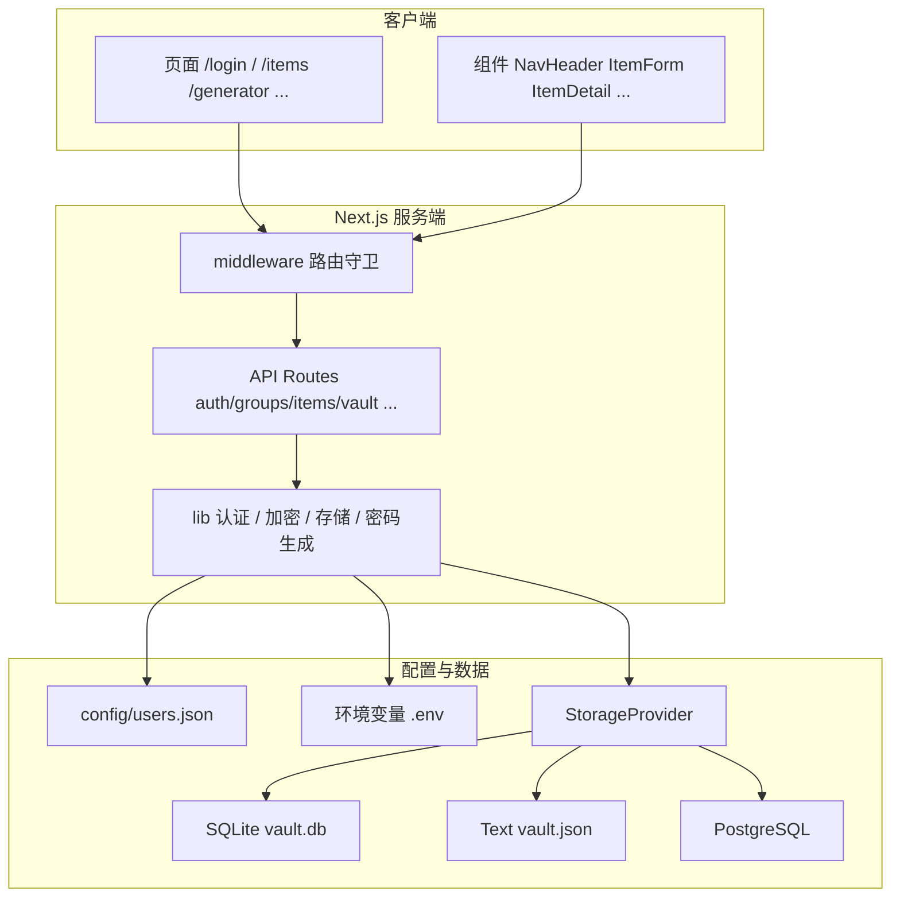
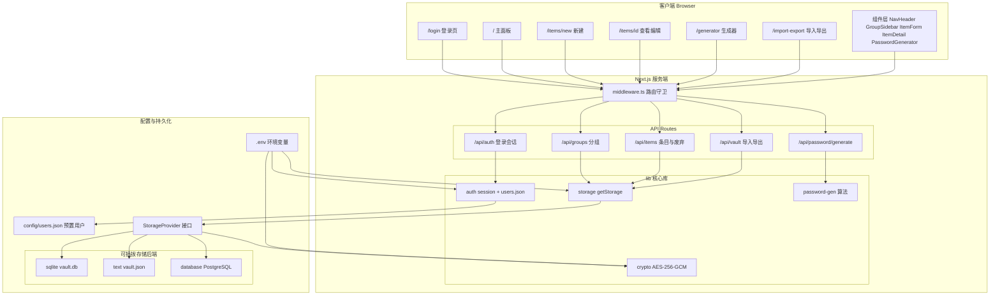
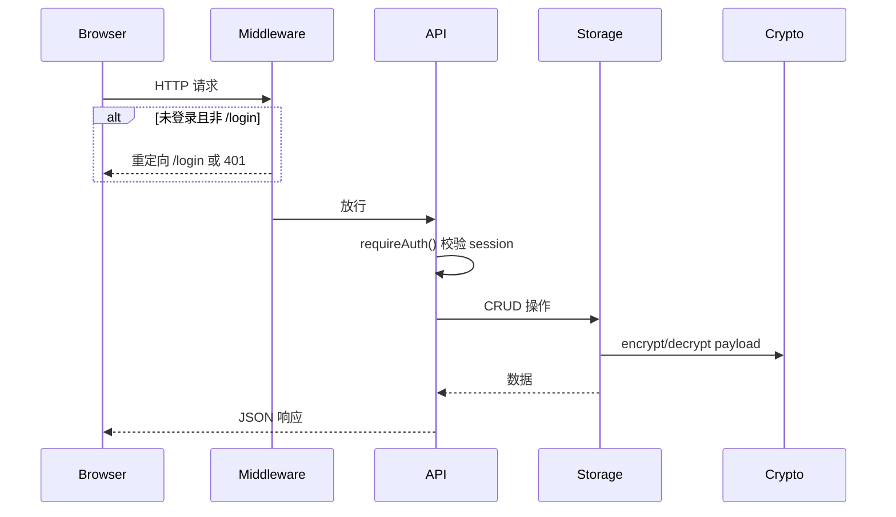
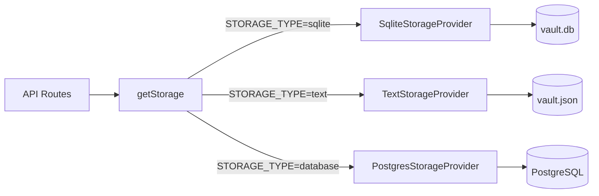
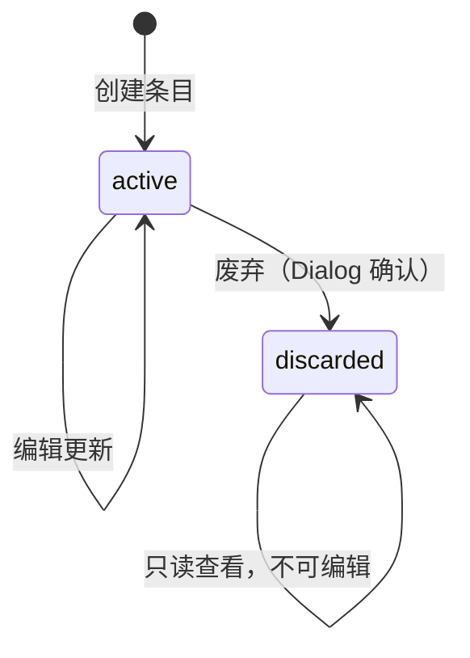

# LockPass 项目 Wiki

> 面向新同事与 AI 工具的项目知识库。涵盖架构、代码结构、数据流、API、组件、运维与开发约定。
>
> 快速上手见 [README.md](README.md)。

---

## 1. 项目概述

**LockPass** 是一个自托管密码管理应用，用于在团队内网安全保存网站账号、个人卡券、IT 运维凭证（SSH/API/Token/服务器）等敏感信息。

### 核心特性

| 特性 | 说明 |
|------|------|
| 单层分组 | 密码条目归属一个分组，分组只有一层，无嵌套 |
| 多类型条目 | 网站 / 个人卡券 / IT-服务器 / IT-RAM用户 / IT-API，字段按类型不同 |
| 密码生成器 | 可配置长度、字符集、最小数量、排除易混淆字符 |
| 导入导出 | JSON 格式全库备份与恢复 |
| 可插拔存储 | 文本文件 / SQLite（默认）/ PostgreSQL |
| 预置用户 | `config/users.json` 配置，不支持注册 |
| 废弃机制 | 条目创建后不可删除，只能标记为「已废弃」；可移至系统「已废弃」分组 |
| 变更记录 | 每次保存记录变更字段，详情页下方倒序展示；敏感字段掩码 + 复制/显示 |
| 服务端加密 | AES-256-GCM 加密敏感 payload |

### 技术栈

- **框架**：Next.js 16 (App Router) + React 19 + TypeScript
- **样式**：Tailwind CSS 4
- **会话**：iron-session
- **校验**：Zod 4
- **ORM**：Drizzle ORM
- **数据库**：better-sqlite3 / postgres.js
- **加密**：Node.js `crypto`（AES-256-GCM）
- **密码哈希**：bcryptjs

### 整体架构

LockPass 采用经典 B/S 分层：浏览器页面 → Next.js 中间件与 API → 核心库 → 可插拔存储后端。敏感 payload 在写入存储前经 AES-256-GCM 加密。



更详细的分层说明、请求时序与存储选型见 [§4 架构与数据流](#4-架构与数据流)。

---

## 2. 快速开始

```bash
# 1. 安装依赖
npm install

# 2. 配置环境变量
cp .env.example .env.local
# 编辑 ENCRYPTION_KEY（64位hex）和 SESSION_SECRET

# 3. 生成加密密钥
node -e "console.log(require('crypto').randomBytes(32).toString('hex'))"

# 4. 配置用户（可选，默认 admin/admin123）
npm run hash-password -- your-password
# 将输出的 hash 写入 config/users.json

# 5. 启动（默认 SQLite）
npm run dev
# 访问 http://localhost:3000
```

### 默认账号

- 用户名：`admin`
- 密码：`admin123`

---

## 3. 目录结构详解

```
lock-pass/
├── config/
│   └── users.json                 # 预置用户列表（运行时读取，修改后需重启）
├── data/                          # 运行时数据目录（gitignore，勿提交）
│   ├── vault.db                   # SQLite 模式
│   └── vault.json                 # Text 模式
├── scripts/
│   └── hash-password.ts           # bcrypt 密码 hash 生成工具
├── src/
│   ├── app/                       # Next.js App Router
│   │   ├── layout.tsx             # 根布局（字体、全局样式）
│   │   ├── globals.css
│   │   ├── login/page.tsx         # 公开：登录页
│   │   ├── (protected)/           # 需登录的路由组
│   │   │   ├── layout.tsx         # NavHeader 导航栏
│   │   │   ├── page.tsx           # 主面板（分组+条目列表）
│   │   │   ├── generator/         # 独立密码生成器
│   │   │   ├── import-export/     # 导入导出
│   │   │   └── items/
│   │   │       ├── new/           # 新建条目
│   │   │       └── [id]/          # 条目详情（查看/编辑）
│   │   └── api/                   # REST API
│   ├── components/                # React 组件
│   ├── lib/                       # 核心业务逻辑
│   └── middleware.ts              # 路由守卫
├── .env.example
├── README.md
└── WIKI.md                        # 本文件
```

### 关键文件索引

| 关注点 | 文件路径 |
|--------|----------|
| 类型定义 | `src/lib/types/index.ts` |
| 存储抽象 | `src/lib/storage/provider.ts` |
| 存储工厂 | `src/lib/storage/index.ts` |
| SQLite 实现 | `src/lib/storage/sqlite.ts` |
| 文本文件实现 | `src/lib/storage/text.ts` |
| PostgreSQL 实现 | `src/lib/storage/postgres.ts` |
| 加解密 | `src/lib/crypto/encryption.ts` |
| 会话配置 | `src/lib/auth/session.ts` |
| 用户加载 | `src/lib/auth/users.ts` |
| 密码生成算法 | `src/lib/password-gen/generator.ts` |
| 路由守卫 | `src/middleware.ts` |
| Next 配置 | `next.config.ts` |

---

## 4. 架构与数据流

### 4.1 整体架构

下图展示 LockPass 从浏览器到持久化存储的完整分层结构，便于快速建立全局认知。



**分层说明：**

| 层级 | 职责 | 关键路径 |
|------|------|----------|
| 客户端 | 页面渲染与用户交互 | `src/app/`、`src/components/` |
| 路由守卫 | 未登录拦截，白名单放行 `/login` | `src/middleware.ts` |
| API | REST 接口，Zod 校验，会话鉴权 | `src/app/api/` |
| 核心库 | 认证、加密、存储抽象、密码算法 | `src/lib/` |
| 持久化 | 用户配置、环境变量、三种存储后端 | `config/`、`data/`、PostgreSQL |

启动时通过 `STORAGE_TYPE` 选择存储后端（默认 `sqlite`），业务层通过 `getStorage()` 统一访问，无需感知具体实现。

### 4.2 请求链路



### 4.3 存储层架构



所有后端实现同一 `StorageProvider` 接口，业务代码通过 `getStorage()` 获取单例，无需关心具体后端。

### 4.4 加密策略

- **加密对象**：整个 `payload`（JSON 对象）序列化后整体加密
- **算法**：AES-256-GCM
- **密钥**：环境变量 `ENCRYPTION_KEY`（64 位十六进制 = 32 字节）
- **存储格式**：`base64(IV[12字节] + authTag[16字节] + ciphertext)`
- **明文存储**：`name`、`type`、`groupId`、`status`（便于列表展示和筛选）

```typescript
// 写入时
encryptedPayload = encrypt(JSON.stringify(payload))

// 读取时
payload = JSON.parse(decrypt(encryptedPayload))
```

---

## 5. 数据模型

### 5.1 类型定义

源文件：`src/lib/types/index.ts`

```typescript
type ItemType =
  | "website"
  | "card"
  | "it_server"
  | "it_ram"
  | "it_api"
type ItemStatus = "active" | "discarded"

interface Group {
  id: string
  userId: string
  name: string
  createdAt: Date
}

interface VaultItem {
  id: string
  userId: string
  groupId: string
  type: ItemType
  name: string
  status: ItemStatus
  payload: WebsitePayload | CardPayload | ItServerPayload | ItRamPayload | ItApiPayload
  createdAt: Date
  updatedAt: Date
}

interface ItemChangeEntry {
  field: string
  oldValue?: string
  newValue?: string
}

interface ItemChangeRecord {
  id: string
  itemId: string
  userId: string
  changes: ItemChangeEntry[]
  createdAt: Date
}
```

### 5.2 各类型 Payload 字段

| 类型 | 显示名 | 字段 | 敏感 |
|------|--------|------|------|
| **website** | 网站 | url, username, password, notes | password |
| **card** | 个人卡券 | cardName, cardNumber, expiry, cvv, pin, holderName, notes | cardNumber, cvv, pin |
| **it_server** | IT-服务器 | instanceId, instanceName, privateIp, publicIp, username, password, notes | password |
| **it_ram** | IT-RAM用户 | platform, accountName, username, password, accessKeyId, accessKeySecret, notes | password, accessKeyId, accessKeySecret |
| **it_api** | IT-API | platform, username, password, apiKey, notes | password, apiKey |

**IT-服务器 SSH 登录指令**：详情页与编辑表单根据 `username` + `privateIp` / `publicIp` 动态生成只读指令（`ssh 用户名@IP`），有值才显示，每条附带复制按钮。指令不写入 payload。

旧版 `it_key`、`it_ssh`、`it_token` 及旧字段（`host`/`secret` 等）在读取与导入时自动迁移为上述类型与字段。

### 5.3 条目状态机



- **active**：正常状态，可查看、编辑、废弃
- **discarded**：已废弃，仅可查看，列表中仍显示（半透明 + 标签）

### 5.4 导出格式

```typescript
interface ExportData {
  version: 1
  exportedAt: string       // ISO 时间戳
  groups: Group[]
  items: VaultItem[]       // payload 为解密后的明文
}
```

### 5.5 条目变更记录

- 每次 `PUT /api/items/[id]` 保存时，与当前数据 diff，**仅记录有变化的字段**为一条 `ItemChangeRecord`
- 变更内容（含敏感字段新值）经 AES-256-GCM 加密后存入 `item_changes` 表（SQLite/PostgreSQL）或 `vault.json` 的 `itemChanges` 数组（Text）
- 创建条目不写入变更记录；无实际变更的保存不写入
- 删除分组、全库 replace 导入时级联清除对应变更记录

---

## 6. API 参考

所有 API 除 `/api/auth/login` 外均需登录（middleware 拦截）。

### 6.1 认证

#### `POST /api/auth/login`

```json
// Request
{ "username": "admin", "password": "admin123" }

// Response 200
{ "username": "admin" }

// Response 400
{ "error": "用户名或密码错误" }
```

- 限速：每 IP 每分钟最多 5 次（`src/lib/api-utils.ts`）
- 成功后设置 `lockpass_session` Cookie

#### `POST /api/auth/logout`

销毁会话，返回 `{ "ok": true }`。

#### `GET /api/auth/me`

```json
{ "isLoggedIn": true, "username": "admin", "userId": "u1" }
```

### 6.2 分组

| 方法 | 路径 | 说明 |
|------|------|------|
| GET | `/api/groups` | 获取当前用户所有分组 |
| POST | `/api/groups` | 创建分组 `{ "name": "工作" }` |
| PUT | `/api/groups/[id]` | 重命名 `{ "name": "新名称" }` |
| DELETE | `/api/groups/[id]` | 删除分组；**有有效条目**时返回 400；仅有已废弃条目时允许删除并将其移至「已废弃」分组 |

### 6.3 条目

| 方法 | 路径 | 说明 |
|------|------|------|
| GET | `/api/items` | 列表，可选 `?groupId=xxx` |
| GET | `/api/items/[id]` | 单条详情（含解密 payload） |
| POST | `/api/items` | 创建，`status` 强制为 `active` |
| PUT | `/api/items/[id]` | 更新，**废弃条目不可更新**；有变更时自动写入变更记录 |
| POST | `/api/items/[id]/discard` | 废弃条目；可选 `{ "moveToDiscardedGroup": true }` 移至「已废弃」分组 |
| GET | `/api/items/[id]/changes` | 获取条目变更记录（倒序） |

#### 创建条目示例

```json
{
  "groupId": "uuid",
  "type": "website",
  "name": "GitHub",
  "payload": {
    "url": "https://github.com",
    "username": "admin",
    "password": "secret123",
    "notes": ""
  }
}
```

### 6.4 密码生成

#### `POST /api/password/generate`

```json
// Request
{
  "length": 16,
  "includeUppercase": true,
  "includeLowercase": true,
  "includeNumbers": true,
  "includeSpecial": true,
  "minNumbers": 1,
  "minSpecialChars": 1,
  "excludeAmbiguous": true
}

// Response
{ "password": "xK9#mP2nQw5rTv7y" }
```

### 6.5 导入导出

#### `GET /api/vault`

返回完整 `ExportData`（明文 payload）。

#### `POST /api/vault`

```json
{
  "mode": "merge",       // "merge" | "replace"
  "data": { /* ExportData */ }
}
```

- **merge**：追加导入，ID 冲突时跳过（SQLite/PG）或可能重复（Text）
- **replace**：清除当前用户所有数据后导入

---

## 7. 前端页面与路由

| 路由 | 组件 | 模式 | 说明 |
|------|------|------|------|
| `/login` | `login/page.tsx` | 公开 | 登录表单 |
| `/` | `(protected)/page.tsx` | 受保护 | 主面板：分组侧边栏 + 条目卡片列表（含快捷复制、仅看生效状态筛选） |
| `/items/new` | `items/new/page.tsx` | 受保护 | 新建条目表单 |
| `/items/[id]` | `items/[id]/page.tsx` | 受保护 | 查看 ↔ 编辑切换；查看模式下详情下方展示变更记录 |
| `/generator` | `generator/page.tsx` | 受保护 | 独立密码生成器 |
| `/import-export` | `import-export/page.tsx` | 受保护 | 导入导出 |

### 7.1 条目详情页状态机

`items/[id]/page.tsx` 维护 `mode: "view" | "edit"`：

```
进入页面 → view（ItemDetail 只读展示 + ItemChangeHistory 变更记录）
  ├─ 点击「编辑」→ edit（ItemForm 表单）
  │    ├─ 保存成功 → view（刷新数据与变更记录）
  │    └─ 取消 → view
  ├─ 点击「废弃」→ Dialog 确认 → 调用 discard API → 刷新为 discarded 状态
  └─ 点击「返回」→ 跳转主面板
```

废弃后：`ItemDetail` 仅显示「返回」按钮，隐藏「编辑」「废弃」。变更记录仍可在详情下方查看。

### 7.2 主面板条目卡片

标签顺序（从左到右）：

1. **已废弃**（红色，仅废弃条目）
2. **类型**（如「网站」）
3. **所属分组**

废弃条目卡片整体 `opacity-70`。

---

## 8. 组件说明

### 8.1 业务组件

| 组件 | 路径 | 用途 |
|------|------|------|
| `NavHeader` | `components/nav-header.tsx` | 顶栏导航：密码库 / 生成密码 / 导入导出 / 退出 |
| `GroupSidebar` | `components/group-sidebar.tsx` | 左侧分组列表；含系统「已废弃」分组（不可编辑/删除） |
| `ItemListCard` | `components/item-list-card.tsx` | 首页条目卡片，按类型展示关键字段并支持一键复制 |
| `ItemDetail` | `components/item-detail/index.tsx` | 条目只读查看，敏感字段掩码 |
| `ItemChangeHistory` | `components/item-change-history/index.tsx` | 条目变更记录卡片列表（倒序，每字段一行） |
| `ItemForm` | `components/item-form/index.tsx` | 创建/编辑表单，内嵌密码生成器 |
| `SshCommandList` | `components/ssh-command-list.tsx` | IT-服务器 SSH 指令只读展示与复制 |
| `PasswordGenerator` | `components/password-generator/index.tsx` | 密码生成器 UI |

### 8.2 敏感数据组件

#### `PasswordInput`（`components/ui/password-input.tsx`）

用于**可编辑**的密码字段（登录页、条目表单）。

- 默认 `type="password"` 掩码
- **按住**眼睛图标 → 显示明文
- **松开** → 恢复掩码
- 有值时显示清除按钮（X）

#### `SensitiveValue`（`components/ui/sensitive-value.tsx`）

用于**只读**敏感字段展示（详情页）。

- 默认显示 `••••••••`
- 按住眼睛图标 → 显示明文
- 可选 `copyable` 属性 → 显示复制按钮（密码、密钥/密码字段已启用）
- 支持 `multiline`（私钥、备注）

#### `Input`（`components/ui/input.tsx`）

通用输入框，有值时右侧显示清除按钮（X）。`type="number"` 不显示清除按钮。

### 8.3 PasswordGenerator 使用方式

```tsx
// 独立页面
<PasswordGenerator />

// 表单内嵌（compact 模式 + 回填）
<PasswordGenerator
  compact
  onSelect={(pwd) => updatePayload("password", pwd)}
/>
```

生成器页面明文显示密码；表单/登录页使用掩码。

### 8.4 列表卡片快捷复制

逻辑在 `src/lib/item-list-preview.ts`，由 `ItemListCard` 渲染。敏感字段列表中掩码显示（`••••••••`），点击复制按钮写入真实值；复制按钮不触发进入详情。

| 类型 | 展示字段 | 可复制 |
|------|----------|--------|
| 网站 | 网站、用户名、密码 | 全部 |
| 个人卡券 | 卡券名称（识别）、卡号、有效期 | 卡号、有效期 |
| IT-服务器 | 实例名称（识别）、SSH 指令、密码 | SSH、密码 |
| IT-RAM用户 | 平台·账号名（识别）、AK、SK | AK、SK |
| IT-API | 平台（识别）、用户名、API Key | 全部 |

---

## 9. 存储后端详解

通过 `STORAGE_TYPE` 环境变量选择，在 `src/lib/storage/index.ts` 工厂中实例化。

### 9.1 SQLite（默认）

- **文件**：`src/lib/storage/sqlite.ts`
- **数据路径**：`{DATA_DIR}/vault.db`
- **依赖**：better-sqlite3 + Drizzle ORM
- **初始化**：`CREATE TABLE IF NOT EXISTS` + `ALTER TABLE` 尝试添加 `status` 列
- **适用**：个人/小团队单进程部署

### 9.2 Text（JSON 文件）

- **文件**：`src/lib/storage/text.ts`
- **数据路径**：`{DATA_DIR}/vault.json`
- **写入**：先写 `.tmp` 文件再 `rename`（原子写入）
- **适用**：简单场景、调试；**不适合多实例并发**

### 9.3 PostgreSQL

- **文件**：`src/lib/storage/postgres.ts`
- **连接**：`DATABASE_URL` 环境变量
- **初始化**：`ensureTables()` 中执行 DDL
- **适用**：多用户、需外部数据库的场景

### 9.4 切换后端

```bash
npm run dev          # SQLite
npm run dev:text     # JSON 文件
npm run dev:db       # PostgreSQL（需配置 DATABASE_URL）
```

> 不同后端数据不互通。切换后端需重新导入数据或迁移。

---

## 10. 认证与用户管理

### 10.1 用户配置

文件：`config/users.json`

```json
[
  {
    "id": "u1",
    "username": "admin",
    "passwordHash": "$2b$10$..."
  }
]
```

- 启动时加载并缓存，**修改后需重启服务**
- 不支持注册、不支持在线修改密码
- 生成 hash：`npm run hash-password -- <明文密码>`

### 10.2 会话

- 库：iron-session
- Cookie 名：`lockpass_session`
- 有效期：7 天
- 配置：`httpOnly`、`sameSite=lax`、`secure` 由 `SECURE_COOKIES` 控制

### 10.3 路由保护

`src/middleware.ts` 白名单：

- `/login`
- `/api/auth/login`
- `/_next/*`、favicon

其余路由：页面重定向到 `/login`，API 返回 401。

---

## 11. 环境变量

| 变量 | 必填 | 默认值 | 说明 |
|------|------|--------|------|
| `STORAGE_TYPE` | 否 | `sqlite` | `text` / `sqlite` / `database` |
| `ENCRYPTION_KEY` | **是** | — | 64 位 hex（32 字节 AES 密钥） |
| `SESSION_SECRET` | **是** | — | iron-session 加密密码（建议 ≥32 字符） |
| `SECURE_COOKIES` | 否 | `false` | `true` 时 Cookie 仅 HTTPS 传输 |
| `DATABASE_URL` | database 模式必填 | — | PostgreSQL 连接串 |
| `DATA_DIR` | 否 | `./data` | 本地数据目录 |

示例见 `.env.example`。

---

## 12. 运维指南

### 12.1 生产部署

```bash
# 1. 配置 .env.local 或环境变量
# 2. 构建
npm run build

# 3. 启动（选择存储后端）
npm run start        # SQLite
npm run start:text   # 文本
npm run start:db     # PostgreSQL
```

### 12.2 数据备份

1. **导出**：登录后访问「导入导出」页面，下载 JSON
2. **直接复制**：
   - SQLite：`data/vault.db`
   - Text：`data/vault.json`

> 直接复制数据库文件时，payload 仍为加密状态。JSON 导出含明文。

### 12.3 数据恢复

通过「导入导出」页面上传之前导出的 JSON，选择合并或全量替换。

### 12.4 添加用户

```bash
npm run hash-password -- newuser-password
```

将输出的 hash 追加到 `config/users.json`，重启服务。

### 12.5 轮换加密密钥

当前实现**不支持**在线轮换 `ENCRYPTION_KEY`。更换密钥需：
1. 导出全部数据（JSON）
2. 更新 `ENCRYPTION_KEY`
3. 全量替换导入

---

## 13. 安全须知

| 风险 | 说明 | 建议 |
|------|------|------|
| HTTP 明文传输 | 默认不强制 HTTPS | 公网部署配置反向代理 + `SECURE_COOKIES=true` |
| 服务端加密 | 管理员持有 `ENCRYPTION_KEY` 可解密全部数据 | 密钥存环境变量，限制服务器访问 |
| 导出文件 | JSON 含明文密码 | 导出后妥善保管，勿提交到版本库 |
| Text 后端 | 单文件无锁，不支持并发写 | 仅单进程使用 |
| 登录暴力破解 | 有限速（5次/分钟/IP） | 内网部署或加 WAF |
| 分组删除 | 有有效条目不可删；仅废弃条目时可删（移至「已废弃」分组） | 前端 Dialog 确认 |

---

## 14. 开发指南

### 14.1 常用命令

```bash
npm run dev          # 开发（SQLite）
npm run build        # 生产构建
npm run lint         # ESLint 检查
npm run hash-password -- <password>  # 生成用户密码 hash
```

### 14.2 添加新条目类型

1. 在 `src/lib/types/index.ts` 添加 `ItemType` 和 Payload 接口
2. 更新 `ITEM_TYPE_LABELS`
3. 在 `ItemForm` 添加对应表单字段
4. 在 `ItemDetail` 添加对应展示字段
5. 更新 API Zod schema（`src/app/api/items/route.ts`）

### 14.3 添加新 API

1. 在 `src/app/api/` 下创建 `route.ts`
2. 使用 `requireAuth()` 获取会话
3. 通过 `getStorage()` 操作数据
4. 使用 `src/lib/api-utils.ts` 中的响应辅助函数

### 14.4 添加新存储后端

1. 在 `src/lib/storage/` 实现 `StorageProvider` 接口
2. 在 `src/lib/storage/index.ts` 工厂中注册
3. 添加对应 `npm run dev:xxx` 脚本

### 14.5 代码约定

- 路径别名：`@/*` → `src/*`
- 组件：业务组件放 `src/components/`，UI 基元放 `src/components/ui/`
- 服务端逻辑：放 `src/lib/`，不在组件中直接操作存储
- 客户端组件：文件顶部 `"use client"`
- 密码字段：编辑用 `PasswordInput`，只读用 `SensitiveValue`
- 数字输入：不加清除按钮

---

## 15. 常见问题（FAQ）

### Q: 忘记 admin 密码怎么办？

编辑 `config/users.json`，用 `npm run hash-password -- 新密码` 生成新 hash 替换，重启服务。

### Q: 如何彻底删除一条废弃条目？

当前不支持。条目只能废弃，不能物理删除。如需清理，可导出 → 编辑 JSON 移除条目 → 全量替换导入。

### Q: 切换 STORAGE_TYPE 后数据在哪？

- `sqlite` → `data/vault.db`
- `text` → `data/vault.json`
- `database` → PostgreSQL 实例

各后端数据独立，需通过导入导出迁移。

### Q: 多用户数据是否隔离？

是。所有查询按 `userId`（来自 session）过滤。每个用户只能看到自己的分组和条目。

### Q: 废弃条目能恢复吗？

当前不支持恢复。`status` 一旦变为 `discarded` 不可回退（需直接改数据库）。

### Q: 为什么密码生成走服务端 API？

统一校验逻辑、便于后续扩展（如密码强度策略），且生成器页面和表单内嵌共用同一接口。

---

## 16. 附录：依赖版本

```json
{
  "next": "16.2.10",
  "react": "19.2.4",
  "iron-session": "^8.0.4",
  "bcryptjs": "^3.0.3",
  "drizzle-orm": "^0.45.2",
  "better-sqlite3": "^12.11.1",
  "postgres": "^3.4.9",
  "zod": "^4.4.3",
  "uuid": "^14.0.1",
  "tailwindcss": "^4"
}
```

---

## 17. 变更记录（相对初始计划）

| 变更 | 说明 |
|------|------|
| 废弃替代删除 | 条目 `status: active \| discarded`，无硬删除 API |
| 查看/编辑分离 | `ItemDetail` + `ItemForm`，`/items/[id]` 模式切换 |
| 移除 it_key.port | IT 运维密钥不再有端口字段 |
| IT 条目类型拆分 | 原 `it_key` + `keyType` 拆为 `it_ssh` / `it_api` / `it_token` / `it_server`，显示名 IT-* 格式 |
| IT 条目字段重构 | 收敛为 IT-服务器 / IT-RAM用户 / IT-API 三类，各类型专属字段；服务器支持 SSH 指令自动生成 |
| 列表快捷复制 | 首页卡片按类型展示关键字段，敏感值掩码 + 一键复制 |
| 列表有效筛选 | 首页支持「仅看生效状态」筛选，默认显示全部条目（含已废弃） |
| 导入日期兼容 | 修复 JSON 导入时分组 `createdAt` 为字符串导致失败的问题 |
| PasswordInput | 按住眼睛显示密码（登录、表单） |
| SensitiveValue | 详情页掩码 + 复制 |
| Input 清除按钮 | 非 number 输入框右侧 X |
| 废弃条目标签 | 列表和详情均显示，排最前 |
| 卡片分组样式 | 与类型标签统一 `bg-muted` 样式 |
| Next.js 16 | 初始计划为 15 |
| 无 drizzle 迁移目录 | 各 Provider 内联 DDL |
| 条目变更记录 | `item_changes` 表 / `vault.json.itemChanges`；详情页 `ItemChangeHistory` 展示 |
| 分组删除限制 | 有有效条目不可删；仅废弃条目时可删并移至「已废弃」分组 |
| 已废弃分组 | 系统分组 `__system_discarded__`，自动创建，不可编辑/删除/手动建条目 |
| 废弃确认 | 条目废弃改用 Dialog 确认，与分组删除交互一致 |

---

*最后更新：2026-07-11*
